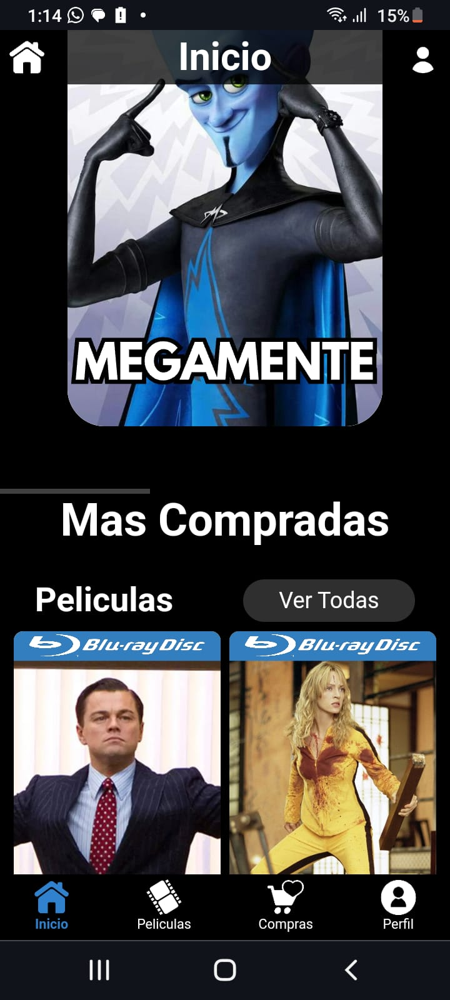
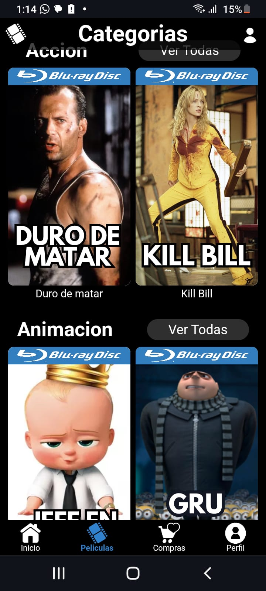
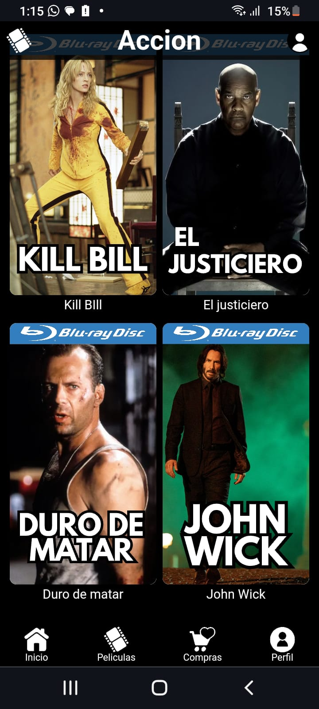
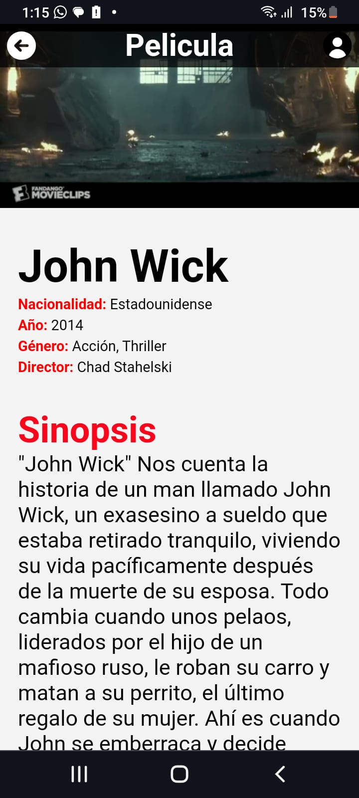
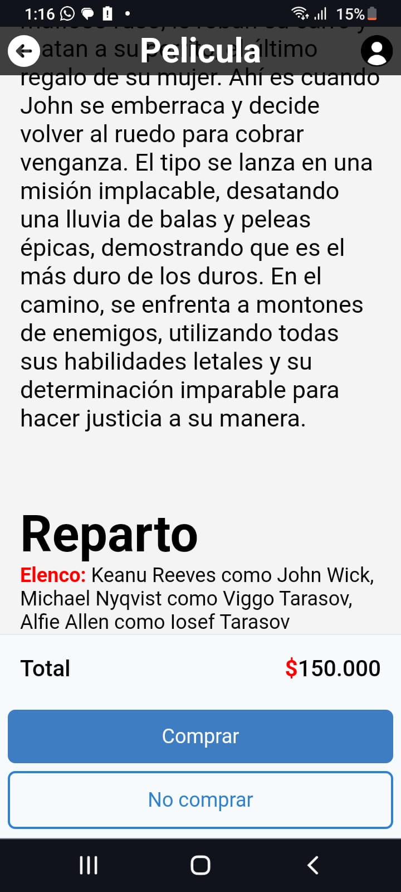
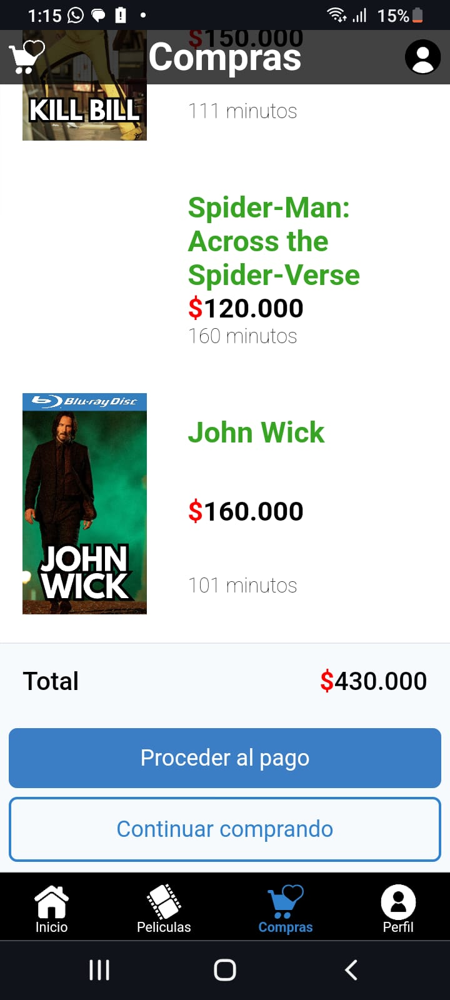

# FireStarApp 🌏🔥

## Tabla de contenido
| Indice | Título  |
|--|--|
| 1. | [Descripción](#Descripcion) |
| 2. | [Características](#Características) |
| 3. | [Tecnologías Utilizadas](#Tecnologias) |
| 4. | [Uso del Repositorio](#Uso) |
| 5. | [Instrucciones de Ejecución](#Instrucciones) |
| 6. | [Imagenes de la pagina](#Imagenes) |
| 7. | [Contacto](#Contacto) |

## Descripcion🚀

El proyecto FireStarApp es una plataforma e-commerce en estado de desarrollo, es la maquetacion para una empresa de ventas de Blue Ray, diseñada para visualizar y comprar las peliculas mas actualizadas y de mejor calidad a mejor precio.

## Características🧮

1. **Peliculas** 🎬: Permite registrar visualizar el catalogo de las peliculas añadidas.

2. **Descripcion** 📄: Permite visualizar la descripcion de cada pelicula.

3. **Categorias** 📄: Permite ver las peliculas divididas por categorias.

4. **Compras** 🛍️: Carrito de compras permite ver las compras y lo añadido para comprar despues.

## Tecnologias🖥️

- **Html** : Se uso para el contenido de la pagina.
- **Css** : Se uso para el diseño de la pagina.

## Uso📝

Este repositorio contiene el código fuente del proyecto FireStarApp, conteniendo toda la maquetacion de la pagina. Cada directorio y archivo está estructurado para facilitar despliegue de la aplicación.

## Instrucciones📐

1. Clona el repositorio a tu máquina local. 
2. Configura adecuadamente todo lo adecuado para abrir el index de html.
3. Abre la app con tu navegador adecuado.

## Imagenes

  
  

## Autor 👤

Leonardo Gonzalez

## Contacto

darkleonardog@gmail.com
