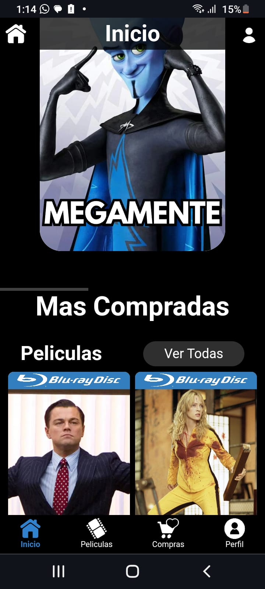
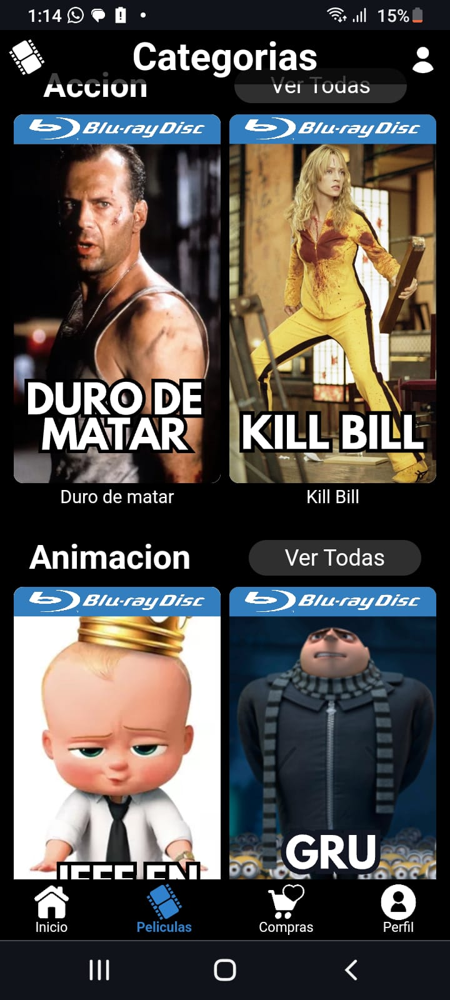
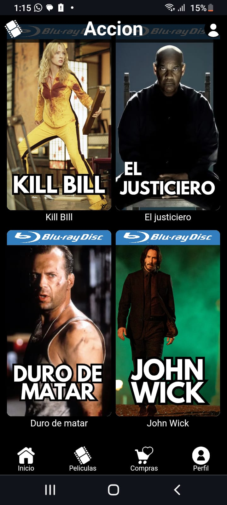
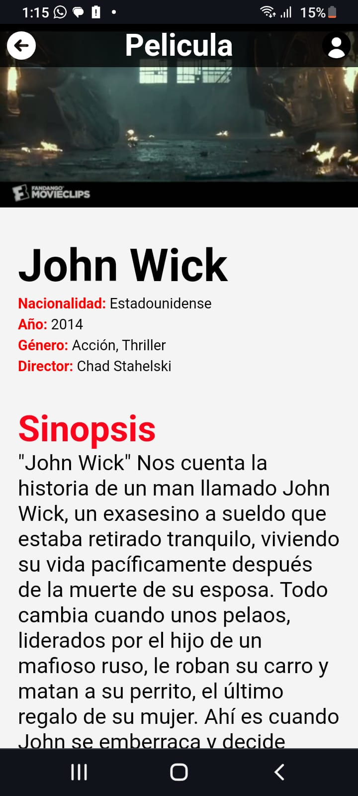
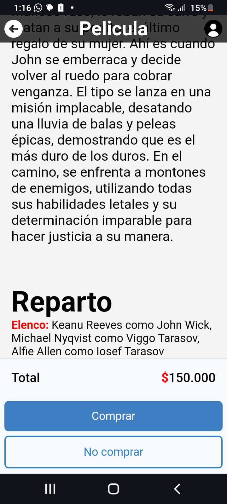
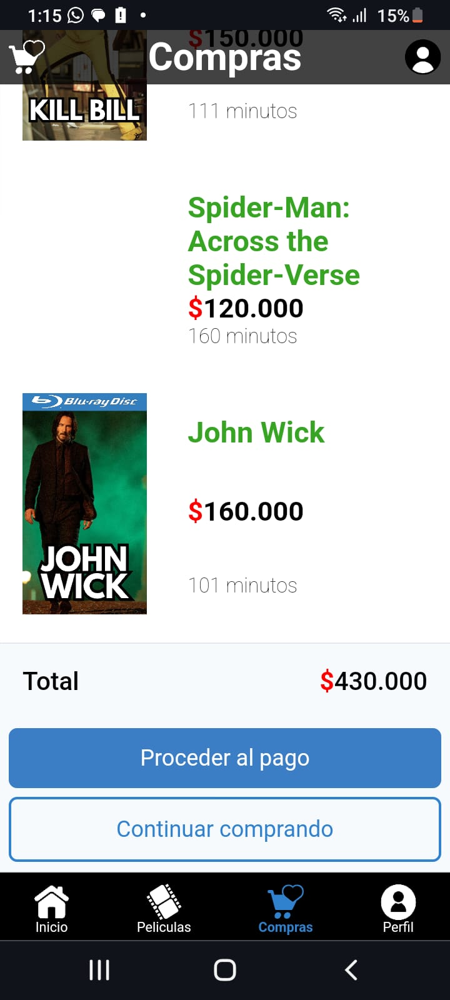

# FireStarApp🔥

## Table of Contents
| Index | Title  |
|--|--|
| 1. | [Description](#Description) |
| 2. | [Features](#Features) |
| 3. | [Technologies Used](#Technologies) |
| 4. | [Repository Usage](#Usage) |
| 5. | [Execution Instructions](#Instructions) |
| 6. | [Page Images](#Images) |
| 7. | [Contact](#Contact) |

## Description🚀

The FireStarApp project is an e-commerce platform under development, focused on selling Blu-ray movies. It is designed to allow users to view and purchase the latest and best-quality movies at the best prices.

## Features🧮

1. **Home** 🎬: Allows proper access to the page.

2. **Description** 📄: Allows users to view the description of each movie.

3. **Categories** 📄: Displays movies divided by categories.

4. **Shopping** 🛍️: A shopping cart to view items added for later purchase.

## Technologies🖥️ 

 

- **HTML**: Used for the content structure of the page.  
- **CSS**: Used for the design and styling of the page.  
- **JavaScript**: Used for all the page's interactivity and dynamic behavior.

## Usage📝

This repository contains the source code for the FireStarApp project, including the complete page layout. Each directory and file is structured to facilitate the deployment of the application.

## Instructions📐

1. Clone the repository to your local machine.  
2. Properly configure everything needed to open the HTML index.  
3. Open the app using an appropriate browser.

## Images

  

  

## Author👤

[Leonardo Gonzalez](https://github.com/DLeonardoG) 

## Contact

Linkedin: <a href="https://www.linkedin.com/in/leonardo-gonzalez-302321311/" target="_blank">Leonardo Gonzalez</a>
